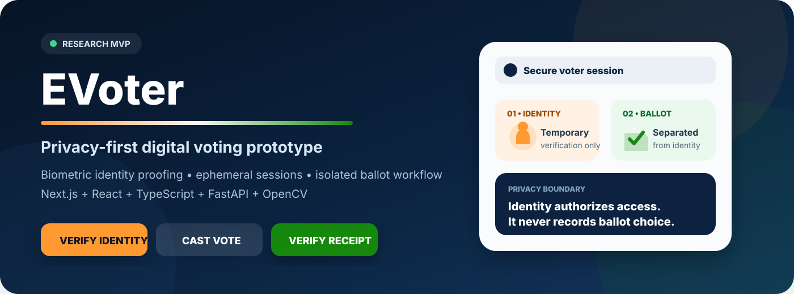
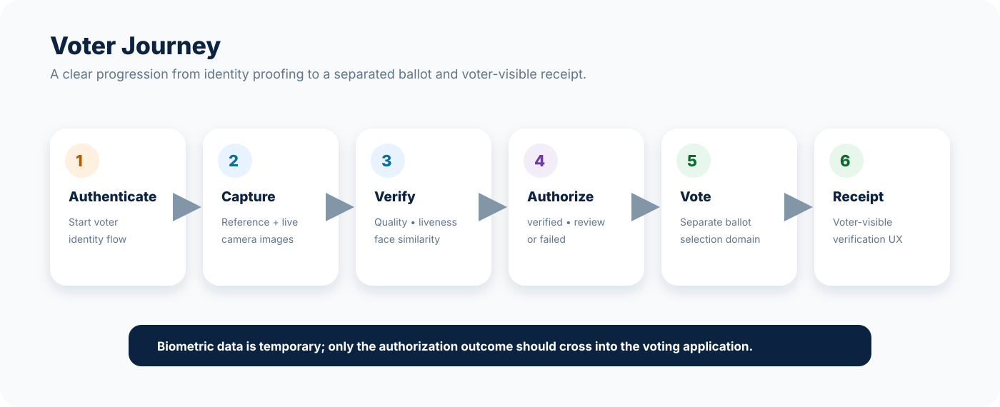
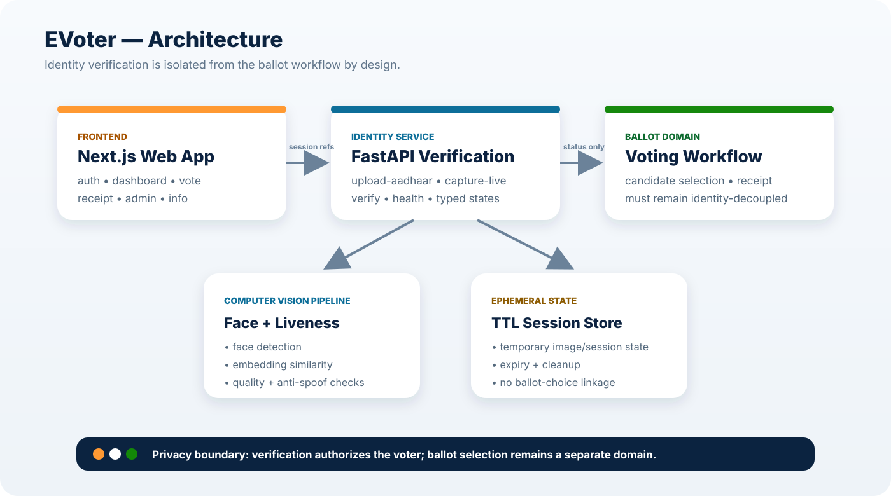

<div align="center">



<br/>

# 🗳️ EVoter

### Privacy-first digital voting & biometric identity verification prototype

[](https://nextjs.org/)
[](https://react.dev/)
[](https://www.typescriptlang.org/)
[](https://fastapi.tiangolo.com/)
[](https://opencv.org/)
[](#-project-status)

**EVoter explores a secure remote-voting experience where identity verification is isolated from ballot choice, biometric artifacts remain ephemeral, and voters receive a clear, auditable workflow.**

[Overview](#-overview) · [Architecture](#-architecture) · [Features](#-core-capabilities) · [Setup](#-local-development) · [API](#-biometric-api) · [Security](#-security--privacy) · [Docs](#-documentation)

</div>

---

## ✨ Overview

EVoter is a full-stack voting prototype that combines a modern **Next.js voter experience** with a standalone **FastAPI biometric verification service**.

The project is designed around one core security boundary:

> **Identity proofing must authorize a voter without creating a technical link between that identity and the voter’s ballot choice.**

The current repository includes voter-facing flows, admin surfaces, receipt verification UI, face-verification APIs, image-quality checks, liveness/face-matching hooks, short-lived verification sessions, and backend tests.

> [!IMPORTANT]
> **EVoter is currently an MVP / research prototype and is not production-ready for real public elections.**  
> Before any real deployment it would require independent security review, penetration testing, election-law review, accessibility validation, infrastructure hardening, model integrity controls, authenticated API access, rate limiting, and formal compliance certification.

---

## 🖼️ Product Experience



The UI is organized around a straightforward voter journey:

1. **Authenticate** — begin through the voter identity flow.
2. **Capture** — provide a reference identity image and a live camera capture.
3. **Verify** — perform image quality, liveness, and face-similarity checks.
4. **Authorize** — return only a constrained verification result to the voting application.
5. **Vote** — cast a ballot through a separate voting flow.
6. **Receipt** — receive or verify a vote receipt without exposing ballot choice.

---

## 🧩 Core Capabilities

| Area | Capability | Current intent |
|---|---|---|
| 🪪 Identity | DigiLocker-oriented authentication UX | Establish an eligible voter session in the prototype UI |
| 📷 Camera | Browser live-capture workflow | Capture a temporary live image for verification |
| 🤖 Face verification | Face detection + embedding comparison | Compare reference and live captures |
| 🛡️ Liveness | Anti-spoofing / liveness result | Distinguish live, spoof, or uncertain outcomes |
| 📐 Quality checks | Blur, brightness, dimensions | Reject unusable captures with reason codes |
| 🧠 Decisioning | `verified`, `manual_review`, `failed` | Keep application routing simple and typed |
| ⏱️ Ephemeral sessions | TTL-based in-memory state | Reduce long-lived biometric data exposure |
| 🧾 Receipt experience | Receipt route and verification UX | Support voter-visible auditability |
| 🧑‍💼 Admin | Admin application surface | Support prototype operational workflows |
| 🧪 Testing | `pytest` backend suite | Validate backend verification behavior |

---

## 🏗️ Architecture



### Separation of concerns

```text
┌───────────────────────────────┐
│        Next.js Web App        │
│ auth • dashboard • vote       │
│ receipt • admin • info        │
└──────────────┬────────────────┘
               │ temporary verification references
               ▼
┌───────────────────────────────┐
│   FastAPI Verification API    │
│ upload • capture • verify     │
└──────────────┬────────────────┘
               │
      ┌────────┴────────┐
      ▼                 ▼
┌─────────────┐   ┌─────────────┐
│ Face /      │   │ Ephemeral   │
│ Liveness ML │   │ Session     │
│ Pipeline    │   │ Store       │
└─────────────┘   └─────────────┘

          identity result only
               │
               ▼
      ┌─────────────────┐
      │ Voting Workflow │
      │ ballot choice   │
      │ remains separate│
      └─────────────────┘
```

### Verification response contract

The biometric service intentionally collapses verification into three application-level outcomes:

| Status | Meaning |
|---|---|
| `verified` | Similarity and liveness checks passed |
| `manual_review` | The automated result is inconclusive |
| `failed` | Verification could not be completed |

The application should use the verification status and reason codes for routing while avoiding long-term storage of raw biometric artifacts.

---

## 🔐 Security & Privacy

EVoter’s backend documentation establishes strict data-minimization rules for the biometric module.

### Privacy principles

- **No permanent raw-image storage by default**
- **No permanent face-embedding storage by default**
- **No Aadhaar identifier returned by the verification service**
- **No biometric data attached to candidate or ballot choice**
- **No raw image / embedding / identity data in logs**
- **Short-lived verification sessions with expiry**
- **Immediate session cleanup after verification**
- **Generic reason codes instead of sensitive debug payloads**

### Production hardening still required

Before real-world election use, the project documentation calls for:

- authenticated API access with short-lived tokens;
- rate limiting and denial-of-service protection;
- cryptographic integrity checks for ML model files;
- third-party security audits and penetration testing;
- production-grade secret management and observability;
- formal privacy, accessibility, election-process, and legal review.

---

## ⚙️ Technology Stack

### Frontend

- **Next.js 16.3**
- **React 19.2**
- **TypeScript**
- App Router
- Browser camera APIs
- Responsive custom CSS UI

### Backend

- **Python**
- **FastAPI**
- **Pydantic**
- **OpenCV**
- **NumPy**
- **Uvicorn**
- **pytest**
- **httpx**

### Computer-vision model configuration

The backend is configurable through environment variables and expects model paths for:

```text
FACE_DETECTION_MODEL_PATH=models/scrfd_500m.onnx
FACE_EMBEDDING_MODEL_PATH=models/adaface_ir50.onnx
LIVENESS_MODEL_PATH=models/silent_face.onnx
```

Model files are deployment assets and should be obtained, licensed, validated, and integrity-checked appropriately before use.

---

## 📁 Repository Structure

```text
EVoter/
├── src/
│   └── app/
│       ├── admin/          # administration UI
│       ├── api/            # Next.js API surface
│       ├── auth/           # voter authentication flows
│       ├── dashboard/      # voter dashboard
│       ├── info/           # informational pages
│       ├── receipt/        # receipt / verification experience
│       ├── vote/           # ballot experience
│       ├── layout.tsx
│       └── page.tsx        # public landing page
│
├── backend/
│   ├── api/                # FastAPI routers
│   ├── config/             # runtime settings
│   ├── docs/
│   ├── schemas/            # typed request/response models
│   ├── services/           # verification services
│   ├── tests/              # backend tests
│   ├── utils/              # session / helper utilities
│   ├── main.py             # FastAPI application entrypoint
│   └── requirements.txt
│
├── docs/
│   ├── api.md
│   ├── privacy.md
│   ├── security.md
│   ├── threshold-tuning.md
│   └── assets/
│       ├── evoter-hero.svg
│       ├── evoter-architecture.svg
│       └── evoter-flow.svg
│
├── package.json
├── next.config.ts
└── tsconfig.json
```

---

## 🚀 Local Development

### Prerequisites

- Node.js compatible with Next.js 16
- npm
- Python 3.10+
- A virtual environment
- Required computer-vision model files for biometric inference

### 1. Clone the repository

```bash
git clone https://github.com/mothinisuresh14072002/EVoter.git
cd EVoter
```

### 2. Install and run the frontend

```bash
npm install
npm run dev
```

Open:

```text
http://localhost:3000
```

### 3. Create the Python environment

#### Windows

```powershell
python -m venv .venv
.venv\Scripts\activate
pip install -r backend/requirements.txt
```

#### macOS / Linux

```bash
python3 -m venv .venv
source .venv/bin/activate
pip install -r backend/requirements.txt
```

### 4. Configure biometric settings

The backend supports environment-based configuration.

```bash
MAX_IMAGE_MB=5
SESSION_TTL_SECONDS=3600
MATCH_THRESHOLD=0.85
MANUAL_REVIEW_THRESHOLD=0.70
MIN_IMAGE_WIDTH=200
MIN_IMAGE_HEIGHT=200
FACE_DETECTION_MODEL_PATH=models/scrfd_500m.onnx
FACE_EMBEDDING_MODEL_PATH=models/adaface_ir50.onnx
LIVENESS_MODEL_PATH=models/silent_face.onnx
CORS_ORIGINS=http://localhost:3000,http://127.0.0.1:3000
```

### 5. Start the biometric API

From the repository root:

```bash
uvicorn backend.main:app --reload --port 8000
```

Useful local endpoints:

```text
API root:    http://localhost:8000/
Health:      http://localhost:8000/health
OpenAPI UI:  http://localhost:8000/docs
```

---

## 🔌 Biometric API

### `POST /upload-aadhaar`

Accepts the temporary reference image used for the prototype verification session.

### `POST /capture-live`

Accepts a temporary live-camera capture.

### `POST /verify`

Example request:

```json
{
  "reference_session_id": "string",
  "live_session_id": "string"
}
```

Example response shape:

```json
{
  "request_id": "string",
  "status": "verified",
  "confidence_score": 0.89,
  "liveness_result": "live",
  "quality_metrics": {
    "blur_score": 125.4,
    "brightness": 130.1
  },
  "reason_codes": [],
  "processing_time_ms": 450.2
}
```

> The voting application should not persist biometric details simply because they are available in a temporary verification response.

---

## 🧪 Testing & Quality

### Frontend lint

```bash
npm run lint
```

### Frontend production build

```bash
npm run build
```

### Backend tests

```bash
pytest backend/tests -q
```

### Health check

```bash
curl http://localhost:8000/health
```

Expected response:

```json
{"status":"ok"}
```

---

## 📚 Documentation

| Document | Purpose |
|---|---|
| [`docs/api.md`](docs/api.md) | Biometric integration contract and typed verification states |
| [`docs/privacy.md`](docs/privacy.md) | Privacy model and biometric data-handling principles |
| [`docs/security.md`](docs/security.md) | Security architecture and production hardening requirements |
| [`docs/threshold-tuning.md`](docs/threshold-tuning.md) | Guidance for verification threshold tuning |

---

## 🗺️ Suggested Roadmap

- [ ] Add authenticated API-gateway protection
- [ ] Add IP- and token-based rate limiting
- [ ] Add model checksum / signature verification
- [ ] Add production-grade secrets management
- [ ] Add stronger automated frontend and end-to-end tests
- [ ] Add accessibility audit for the full voting journey
- [ ] Add independent threat modeling and penetration testing
- [ ] Add formal election-process and privacy compliance review
- [ ] Add documented disaster-recovery and incident-response procedures
- [ ] Add reproducible deployment and infrastructure configuration

---

## 🤝 Contributing

Contributions should preserve EVoter’s key privacy boundary:

> **Never create a data path that can associate biometric identity-verification artifacts with a voter’s ballot choice.**

When contributing:

1. Keep changes focused and testable.
2. Do not log raw images, embeddings, Aadhaar identifiers, or secrets.
3. Prefer typed reason codes for verification failures.
4. Add or update tests for backend behavior.
5. Document any change that affects privacy or security assumptions.

---

## ⚠️ Project Status

This repository is best treated as a **technical prototype / research MVP**.

It is useful for experimenting with:

- privacy-conscious biometric identity proofing;
- voter workflow UX;
- temporary session handling;
- face and liveness verification interfaces;
- typed verification decisions;
- separation between identity authorization and ballot selection.

It should **not** be represented as a certified election platform or deployed for real public voting without substantial independent validation and hardening.

---

<div align="center">

### 🇮🇳 EVoter

**Identity can be verified. Ballot choice must remain private.**

Made for secure-voting research and responsible experimentation.

</div>
